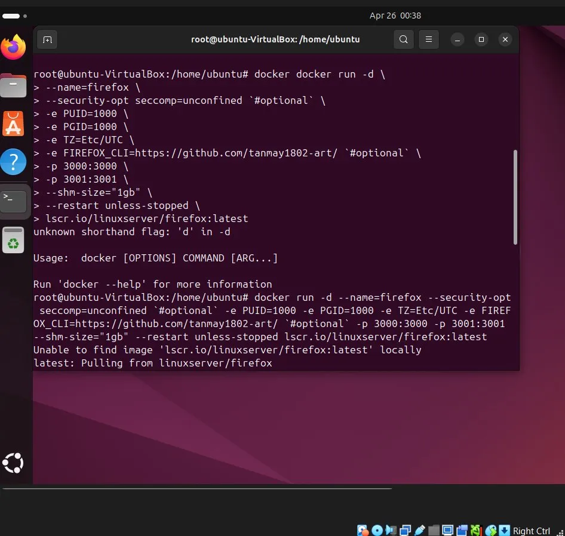

# docker-practice
Docker practice on Ubuntu VirtualBox - containers, networking, macvlan setup
Also ran GUI applications like Firefox and LibreOffice 
inside Docker containers and accessed them via browser on localhost.
#  Docker Practice on Ubuntu

##  Description
This is my personal Docker practice log. I explored Docker installation, 
container management, port mapping, and macvlan network configuration then i also try to put my github profile in a docker container in local host server...then i tried with libreoffice..still exploring more to know docker well.
i tried this on Ubuntu running inside VirtualBox.

---

##  What I Practiced

### 1. Install Docker
```bash
sudo apt install docker.io  -y
```

### 2. Run Containers
```bash
sudo docker run -itd --name stormbraker nginx
sudo docker run -itd --name mjolnir busybox sh
sudo docker run -itd --name thor busybox sh
```

### 3. Check Running Containers
```bash
sudo docker ps
```

### 4. Stop a Container
```bash
sudo docker stop stormbraker
```

### 5. Run Container with Port Mapping
```bash
sudo docker run -itd --rm -p 80:80 --name stormbraker nginx
```

### 6. Check IP Address
```bash
ip address show
```

### 7. Create Macvlan Network
```bash
sudo docker network create -d macvlan \
  --subnet 10.0.2.0/24 \
  --gateway 10.0.2.1 \
  -o parent=enp0s3 \
  newasgard 
```

### 8. Inspect Bridge Network
```bash
sudo docker inspect bridge
```
--- 

## 📸 Screenshots

### Docker Install


### Docker Run Nginx


### Docker PS & Containers


### Docker Exec


### IP Address


### Docker Network Create


### Docker Inspect Bridge


### 9. Run Firefox in Docker
```bash
docker run -d \
  --name=firefox \
  --security-opt seccomp=unconfined \
  -e PUID=1000 \
  -e PGID=1000 \
  -e TZ=Etc/UTC \
  -p 3000:3000 \
  -p 3001:3001 \
  --shm-size="1gb" \
  --restart unless-stopped \
  lscr.io/linuxserver/firefox:latest
```




### 10. Run LibreOffice in Docker
```bash
docker run -d \
  --name=libreoffice \
  --security-opt seccomp=unconfined \
  -e PUID=1000 \
  -e PGID=1000 \
  -e TZ=Etc/UTC \
  -p 3005:3000 \
  -p 3006:3001 \
  --restart unless-stopped \
  lscr.io/linuxserver/libreoffice:latest
```


## 📝 What I Learned
- How to install Docker on Ubuntu
- How to run and manage containers
- How to map ports between host and container
- How to check network interfaces using `ip address`
- How to create a macvlan network in Docker - How to run GUI apps like Firefox and LibreOffice inside Docker
- How to access containerized apps via browser on localhost
